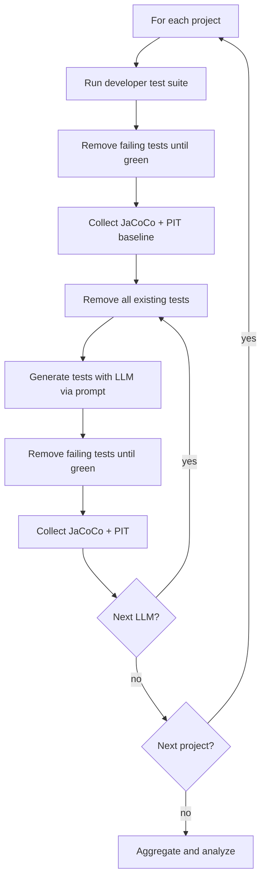

# Experimental Protocol

**Paper reference:** Section 4.5, Figure 1

**Artifact scope:** This package documents the full procedure for all five paper projects. Published metrics are shipped in `results/per-class/`; source code is cloned locally via `scripts/00_setup.*`. See [`package-scope.md`](package-scope.md).

This document describes the controlled procedure used to compare developer-written and LLM-generated unit test suites.

## Research questions

| RQ | Question |
|----|----------|
| RQ1 | How effective are LLM-generated test suites vs. developer-written suites in terms of **code coverage**? |
| RQ2 | How effective are they in terms of **mutation coverage** and **test strength**? |
| RQ3 | How does **code complexity** affect coverage and defect detection? |
| RQ4 | How do **different LLMs** compare when generating suites for the same projects? |

## Subject systems

Five Apache Commons projects (see `config/projects.json`, Paper Table 1):

- Commons Collections 4.6.0
- Commons Compress 1.29.0
- Commons Lang 3.20.1
- Commons CLI 1.11.0
- Commons BCEL 6.13.0

**Selection criteria:** Maven build, existing developer test suites, PIT compatibility without project modification.

## Pipeline overview



## Step-by-step procedure

### Phase A — Developer baseline (per project)

1. Checkout project at exact version (`scripts/00_setup.ps1`).
2. Run the original developer-written test suite.
3. **Filter failing tests:** remove tests that fail compilation or execution, one at a time or in batches, until all remaining tests pass. PIT requires a green suite.
4. Log removed tests during local reproduction (optional).
5. Collect metrics:
   ```bash
   mvn clean test jacoco:report
   mvn test org.pitest:pitest-maven:mutationCoverage
   ```
6. Copy raw reports to `results/raw/<project>/developer/`.

### Phase B — LLM-generated suite (per project × model)

Repeat for each of: Opus 4.5, GPT-5.1 Codex Max, Sonnet 4.5.

1. Start from production code only: **remove all tests** under `src/test/java`.
2. Open project in Cursor Pro 2.1.39 with Java 21.
3. Apply the standardized prompt (`prompts/test-generation-prompt.md`) with the selected model.
4. Compile and run generated tests.
5. Filter failing tests until suite is green (same as baseline).
6. Collect JaCoCo and PIT metrics (same commands as Phase A).
7. Copy raw reports to `results/raw/<project>/<model-id>/` (optional; gitignored).

### Phase C — Analysis

1. Inspect published per-class metrics in `results/per-class/` (included in the artifact).
2. Regenerate aggregated tables with `scripts/05_aggregate_tables.py`.
3. Optionally parse locally collected reports with `scripts/optional/04_parse_results.py`.
4. Compare against Paper Tables 2–4 and Figures 2–5.

## Experimental scope

| Dimension | Count |
|-----------|-------|
| Projects | 5 |
| LLM models | 3 |
| LLM runs | 15 (5 × 3) |
| Baseline runs | 5 |
| **Total metric collection runs** | **20** |

## Controls

- Same prompt for all models and projects
- Same tools (JaCoCo, PIT) and Maven commands
- Same machine and Java 21 environment
- Same failing-test filtering policy
- Class-level analysis unit

## Metrics collected (per class)

| Metric | Source |
|--------|--------|
| Line coverage | JaCoCo |
| Branch coverage | JaCoCo |
| Cyclomatic complexity | JaCoCo |
| PIT line coverage | PIT |
| Mutation coverage | PIT |
| Test strength | PIT |

## High-complexity classes (Table 3)

The paper reports metrics for high-complexity classes but does not define an explicit threshold in the manuscript. When replicating Table 3, document the threshold used (e.g., top quartile of cyclomatic complexity per project) in `results/processed/high-complexity-threshold.md`.
